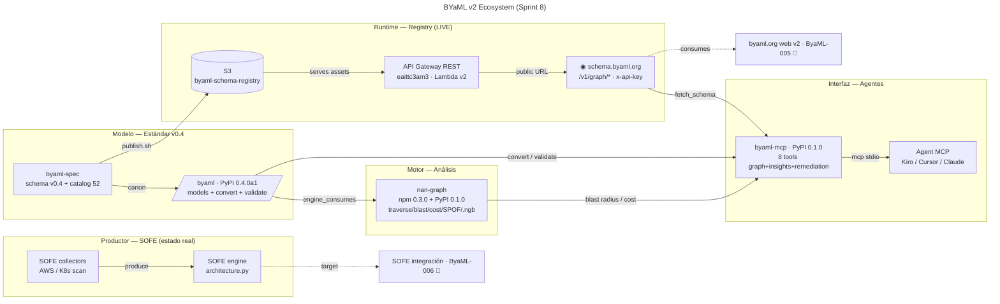

# BYaML v2 — Ecosystem Map

> Mapa del ecosistema OSS **BYaML v2 / SOFE Architecture Graph** bajo la org `breakingthecloud`.
> Fecha: 2026-08-21.
> Dogfooding: el grafo se construye con **nan-graph** (ver `examples/ecosystem-byaml-v2.mjs` en el repo
> `breakingthecloud/nan-graph`), que exporta el mermaid plano con los mismos nodos/edges.

---

## Super Mermaid (flowchart)

---

## Nodos del ecosistema (statu)

| Componente | Repo / artefacto | Capa | Status |
|---|--|--|:--:|
| SOFE collectors | `~/dev/breakingthecloud/sofe` (`collectors/`) | Productor | 🟢 live |
| SOFE engine | `sofe/engine/architecture.py` (origen del grafo) | Productor | 🟢 live |
| `byaml-spec` | `breakingthecloud/byaml-spec` (Apache-2.0) | Modelo | 🟢 live |
| `byaml` | PyPI `byaml==0.4.0a1` | Modelo/Motor | 🟢 live |
| `nan-graph` | npm `@carloscortezcloud/nan-graph@0.3.0` + PyPI `nan-graph==0.1.0` | Motor | 🟢 live |
| S3 registry | `byaml-schema-registry` (v0.4.0 publicada) | Runtime | 🟢 live |
| Registry API | Lambda `byaml-schema-api-api` + API GW `eaittc3am3` | Runtime | 🟢 live |
| `schema.byaml.org` | dominio público `/v1/graph/*` (x-api-key) | Runtime | 🟢 live |
| `byaml-mcp` | PyPI `byaml-mcp==0.1.0` (8 tools) | Interfaz AI | 🟢 live |
| Agent MCP | Kiro / Cursor / Claude (`uvx byaml-mcp`) | Consumidor | 🟢 adoptable |
| `byaml.org` web v2 | ByaML-005 | Docs/UX | 🔴 pendiente |
| SOFE integración | ByaML-006 | Cierre ciclo | 🔴 pendiente |

---

## Flujos clave (edges del grafo)

| Edge | Descripción |
|---|--|
| `SOFE collectors → SOFE engine` | scan producido del mundo real |
| `SOFE engine → byaml` | grafo real normalizado a modelo v0.4 |
| `byaml-spec → byaml` | canon declarativo → motor validante (no divergen, verificado) |
| `byaml-spec → S3 → API GW → schema.byaml.org` | publicar → servir → dominio público |
| `schema.byaml.org → byaml-mcp` | el MCP aprende el schema/catalog on-demand |
| `nan-graph → byaml-mcp` | blast radius / cost / SPOF como insights |
| `byaml → byaml-mcp` | convert + validate |
| `byaml-mcp → Agent` | interfaz AI-native stdio |

---

## Estados (leyenda)

- 🟢 **live**: implementado + deployado/público (03 ó 04)
- 🟡 / ⏳: parcial
- 🔴 **pendiente**: siguiente SoW

## Referencias

- Repos OSS: `breakingthecloud/byaml-spec` · `byaml-py` · `nan-graph` · `byaml-schema-api` · `byaml-mcp`
- Schema registry live: https://schema.byaml.org/v1/graph/schema/version/latest (con `x-api-key`)
- MCP: `pip install byaml-mcp` → `uvx byaml-mcp`
- Estándar v0.4 del modelo: `schema/v0.4/` (este repo) + `byaml-py` (motor/canon)
- Roadmap SoWs (interno): `cc-roadmap/oss-ecosystem/` (byaml-00X + nan-00X)